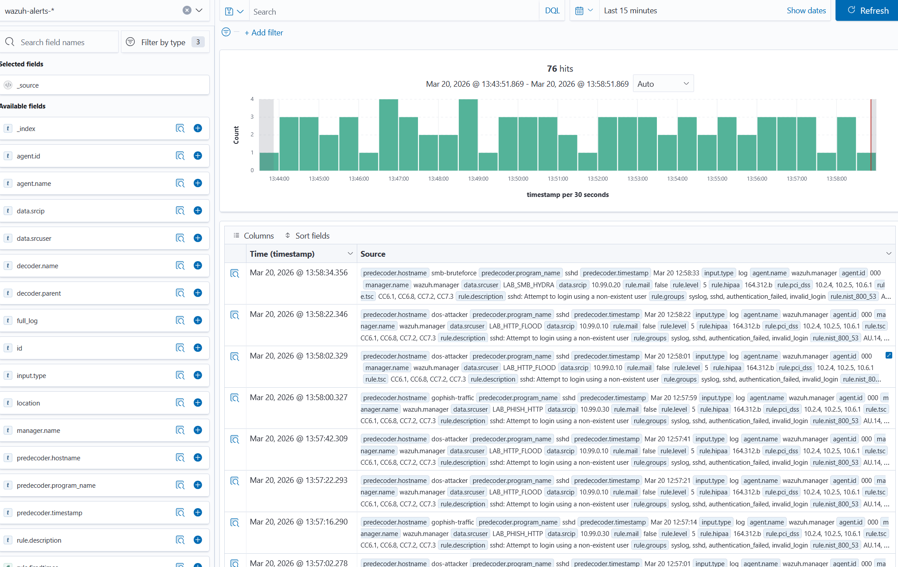

# SOC lab: Wazuh + automated attack traffic (Docker)
# Author: Mesud Pasic (Setec d.o.o. & Tranchulas d.o.o.)
# Contact: office@setec.ba




This layout runs a **Wazuh** single-node stack (official images) alongside **lab-only** containers that generate:

- **HTTP load** against a small Nginx target (DoS *demonstration* — local bursts only)
- **SMB authentication attempts** against a Samba “file server” (stand-in for **Windows-style** brute forcing; real `winrm`/`mstsc` targets usually need a Windows VM or Windows containers)
- **Gophish** (official release, container-built) plus a tiny client that polls the phishing HTTP listener
- **Benign “malware” theatre**: downloads/writes the **EICAR** test string and junk files (no real malware)

Use this only on an **isolated host or lab network**. Do not expose Wazuh, Gophish, or Samba ports to the internet.

## Prerequisites

- Docker Desktop (or Docker Engine) with **Compose v2**
- **Git** (to fetch Wazuh’s upstream `single-node` config and TLS material)
- **Python 3** (for `scripts/patch-vendor-dashboard-compose.py` during `init-lab`)
- ~8 GB RAM recommended (Wazuh Indexer + Manager + Dashboard are heavy)

## One-time: vendor Wazuh and generate certificates

Wazuh ships TLS config and a small generator compose file; you must run it once.

**Windows (PowerShell), from this directory:**

```powershell
.\scripts\init-lab.ps1
```

**Linux / macOS:**

```bash
chmod +x scripts/init-lab.sh scripts/up.sh
./scripts/init-lab.sh
```

## Start the full lab

**Windows:**

```powershell
.\scripts\up.ps1 up -d --build
```

**Linux / macOS:**

```bash
./scripts/up.sh up -d --build
```

`--build` ensures the Gophish image is built the first time.

Equivalent manual command:

```bash
docker compose -p soclab -f .vendor/wazuh-docker/single-node/docker-compose.yml -f compose.lab.yml up -d --build
```

## URLs and ports (host)

| Service | URL / port | Notes |
|--------|------------|--------|
| Wazuh Dashboard | **`http://127.0.0.1:5601`** | Plain HTTP. `init-lab` copies `config/wazuh_dashboard/opensearch_dashboards.yml` into the vendor tree (`server.ssl.enabled: false`) and rewrites the published port from `443` to **`5601`**. Re-run **`init-lab`** after a fresh `wazuh-docker` clone to re-apply. |
| Wazuh API (manager) | `1514`, `1515`, `55000` | Agent / registration (defaults from upstream) |
| Indexer | `9200` | OpenSearch API (TLS) |
| Gophish admin | `http://127.0.0.1:3333` | First run: get the random **admin** password from container logs |
| Gophish phishing HTTP | `http://127.0.0.1:8085` | Mapped to phish listener port 80 inside the container |
| Samba (lab) | `445` → host `4445`, `139` → `4139` | For optional manual tools from the host |

### Default credentials (lab)

Password for all roles below: **`#SETEC.doo26#`** (quote in YAML / env where needed).

| Role | Username | Notes |
|------|----------|--------|
| Indexer (OpenSearch) `admin` | `admin` | Browser login to the dashboard typically uses this account. |
| Dashboard → indexer (keystore) | `kibanaserver` | Internal OpenSearch user; same password as above. |
| Wazuh API (dashboard app → manager) | `wazuh-wui` | Set in `config/wazuh_dashboard/wazuh.yml`. |

`init-lab` copies `config/wazuh_indexer/internal_users.yml` and `config/wazuh_dashboard/wazuh.yml` into `.vendor/wazuh-docker/single-node/config/`, and rewrites default passwords in the vendor `docker-compose.yml` (Compose merge cannot override `environment` on included services). After changing passwords, re-run **`init-lab`**, then recreate the stack (indexer, manager, and dashboard at minimum).

**Wazuh API user (`wazuh-wui`)** is initialized inside the **`wazuh_api_configuration`** volume on **first** manager start. If you already ran the stack with a different `API_PASSWORD`, remove that volume (see **Error 3002 / HTTP 400** below) so the new password is applied.

If login fails after an upgrade, check the [Wazuh Docker documentation](https://documentation.wazuh.com/current/deployment-options/docker/wazuh-container.html) for changes.

### “No API available” / missing `wazuh-alerts-*` index pattern

Usually one or both of:

1. **Dashboard volume order** — Upstream `single-node` mounts `wazuh.yml` *before* the `wazuh-dashboard-config` named volume, so the volume replaces `/data/wazuh/config` and the bind-mounted lab `wazuh.yml` never appears. **`init-lab`** runs `scripts/patch-vendor-dashboard-compose.py` to mount the named volume first, then overlay `wazuh.yml`.
2. **Manager API TLS** — The app calls `https://wazuh.manager:55000` with a self-signed cert. The lab sets **`NODE_TLS_REJECT_UNAUTHORIZED=0`** on the dashboard service (same patch script).

After pulling changes, re-run **`init-lab`**, then recreate the dashboard (and manager if needed):

```bash
docker compose -p soclab up -d --force-recreate wazuh.dashboard wazuh.manager
```

If the old named volume still has a bad `wazuh.yml`, remove only the dashboard config volume (you will lose dashboard-side saved settings): `docker volume rm soclab_wazuh-dashboard-config` (name may vary; use `docker volume ls | grep wazuh-dashboard`).

### Error **3002** / HTTP **400** from the Wazuh plugin (`genericReq` … `wazuh.plugin.js`)

The UI calls the **Wazuh manager API** (`https://wazuh.manager:55000`). A **400** is often **`error: 1017`** — *“Some Wazuh daemons are not ready yet”* — usually because **`wazuh-analysisd` is not running**.

**Cause A (seen on fresh/year rollover):** `wazuh-analysisd` exits with **CRITICAL (1107)** if it cannot create year directories under `/var/ossec/logs` (e.g. `logs/alerts/2026/`, `logs/archives/2026/`, `logs/firewall/2026/`). Then the API returns **400** on `POST /security/user/authenticate` even with the correct password.

**Fix A — create dirs and start daemons:**

```powershell
.\scripts\ensure-wazuh-log-year-dirs.ps1
```

(Linux/macOS: `chmod +x scripts/ensure-wazuh-log-year-dirs.sh && ./scripts/ensure-wazuh-log-year-dirs.sh`)

Then hard-refresh the dashboard. Confirm the API:

```powershell
.\scripts\verify-wazuh-api.ps1
```

You should see JSON with a **`token`** and **`error": 0`**, and `http_code:200`.

**Cause B:** the **`wazuh_api_configuration`** volume was created **before** you set the lab `API_PASSWORD`. The API user is stored there on first start; changing env later may not update it.

**Fix B (destructive for API security DB only):**

```powershell
docker compose -p soclab stop wazuh.manager
docker volume rm soclab_wazuh_api_configuration
docker compose -p soclab up -d wazuh.manager
```

Use `docker volume ls` to match the volume name if your project prefix differs.

### Gophish first login

```bash
docker logs gophish 2>&1 | findstr /i "password"
```

On Linux/macOS use `grep -i password`.

### Samba lab account (for a successful manual login)

- User: `Administrator`
- Password: `LabWindows01!`
- Share: `data` (the automated brute container uses passwords that **omit** this one so attempts stay mostly failed)

## What runs automatically

| Container | Role |
|-----------|------|
| `dos-target` | Nginx |
| `dos-attacker` | Parallel `wget` bursts to `http://dos-target/` |
| `smb-victim` | Samba share |
| `smb-bruteforce` | `hydra` SMB against `smb-victim` in a loop |
| `gophish` | Phishing framework |
| `gophish-traffic` | HTTP requests into Gophish’s listener |
| `malware-sim` | EICAR + harmless file writes under `/tmp/lab-malware` |

## Seeing attack lab alerts in Wazuh (built-in)

Attack containers share a Docker volume **`attack-telemetry`** at `/telemetry`. On each simulation cycle they append **syslog-shaped lines** that match Wazuh’s built-in **OpenSSH** decoders (brute-force style), so the manager raises normal **SSH authentication failed** alerts—not a literal parse of Hydra/SMB/Gophish protocols.

**Setup (once, after `init-lab`):**

1. `init-lab` (or `.\scripts\patch-wazuh-manager-lab-log.ps1` / `./scripts/patch-wazuh-manager-lab-log.sh`) appends a `<localfile>` entry to the vendor `wazuh_manager.conf` for `/var/ossec/logs/lab-attack/events.log`.
2. Bring the stack up; then **restart the manager** so logcollector picks up the new stanza:  
   `docker compose restart wazuh.manager`
3. Wait a minute for cycles (dos / smb / phish / malware have staggered sleeps). In the dashboard open **Threat intelligence → Threat hunting** (or **Discover** on `wazuh-alerts-*`) and filter by usernames such as **`LAB_HTTP_FLOOD`**, **`LAB_SMB_HYDRA`**, **`LAB_PHISH_HTTP`**, **`LAB_EICAR_SIM`**, or by source **10.99.0.x**.

**Synthetic vs. real logs:** These lines are **intentional telemetry** so the lab shows alerts without deploying agents on every container. For real endpoint/protocol evidence, still use **Wazuh agents**, **syslog**, or **Docker collection** as in the [Wazuh documentation](https://documentation.wazuh.com/current/).

## Stop and clean

```bash
docker compose -p soclab -f .vendor/wazuh-docker/single-node/docker-compose.yml -f compose.lab.yml down
```

Remove volumes (resets Gophish DB, Samba data, attack telemetry log, malware drop dir):

```bash
docker compose -p soclab -f .vendor/wazuh-docker/single-node/docker-compose.yml -f compose.lab.yml down -v
```

## Windows: attack scripts must use LF line endings

The files in `attacks/*.sh` are bind-mounted into **Alpine**. Compose runs them through `tr -d '\r'` before `/bin/sh`, so **CRLF from Windows should not break** `sleep`, `do`, etc. If you still see odd errors, normalize line endings and recreate containers.

After editing on Windows, you can still normalize line endings:

```powershell
.\scripts\normalize-attack-scripts.ps1
```

Then recreate the containers: `docker compose up -d --force-recreate dos-attacker smb-bruteforce malware-sim gophish-traffic`.

## Windows “victim” note

A full **Windows desktop/server** with WinRM/RDP is not represented here in pure **Linux** containers. The **SMB** target is the pragmatic Docker-friendly analogue: clients use the same protocol family as Windows file sharing, and tools like Hydra exercise authentication failures suitable for SOC exercises. For real Windows telemetry, add a Windows VM and a Wazuh agent.

## Files

- `compose.lab.yml` — attack / victim / Gophish services
- `scripts/init-lab.ps1` / `init-lab.sh` — clone `wazuh-docker` v4.8.2 + generate certs
- `scripts/up.ps1` / `up.sh` — run merged compose with project name `soclab`
- `attacks/*.sh`, `attacks/lab-telemetry.sh` — automation loops + shared Wazuh telemetry helper
- `scripts/patch-wazuh-manager-lab-log.ps1` / `.sh` — append lab `<localfile>` to vendor `wazuh_manager.conf` if `init-lab` was skipped
- `scripts/normalize-attack-scripts.ps1` — rewrite `attacks/*.sh` with Unix (LF) line endings
- `images/gophish/Dockerfile` — builds Gophish from official GitHub release binaries
